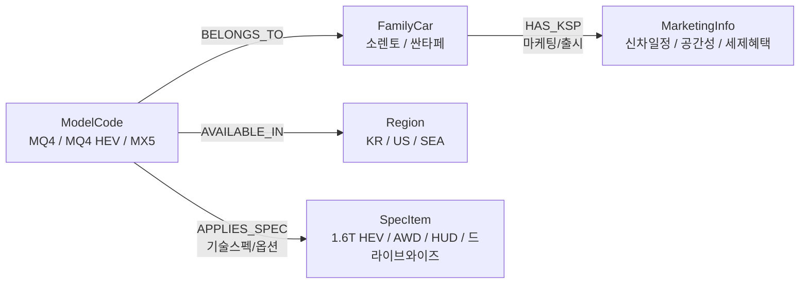

# 🚘 Google Cloud BigQuery Graph Semantic Subgraph Explorer

[](https://www.python.org/)
[](https://streamlit.io/)
[-4285F4.svg?logo=googlecloud&logoColor=white)](https://cloud.google.com/bigquery)
[](LICENSE)

**Google Cloud BigQuery Graph (GQL)** 및 **시맨틱 온톨로지(Semantic Ontology)** 기반의 차량 지식 그래프 탐색 및 LLM 컨텍스트 그라운딩 시뮬레이터입니다.

사용자의 발화 의도(`INFO_SEARCH` vs `PURCHASE_INTENT`)와 비즈니스 공리(Axioms & Constraints)에 따라 최적의 지식 서브그래프를 실시간으로 탐색하고, BigQuery GQL 표준 쿼리 생성 및 RAG 컨텍스트 주입 결과를 시각화합니다.

---

## 🌟 주요 기능 (Key Features)

### 1. 🕸️ 듀얼 그래프 렌더링 엔진 (Dual Graph Visualization)
- **PyVis (Vis.js Physics)**: `forceAtlas2Based` 물리 시뮬레이션으로 노드가 자연스럽게 퍼지며 자유로운 드래그, 줌, 팬 인터랙션 제공.
- **Cytoscape.js (COSE Layout)**: 생물정보학/네트워크 공학 표준 계층 레이아웃 및 베지어 곡선(Bezier Curve) 엣지 제공.
- **마우스 호버 카드 툴팁**: 노드 및 엣지에 마우스를 올리면 상세 메타데이터와 가중치 정보가 카드 형태로 렌더링.

### 2. 🎨 10대 개발자 인기 IDE 테마 실시간 전환
사이드바에서 라이트/다크 테마를 실시간으로 전환할 수 있으며, 전체 UI 배경, 카드, 텍스트, 그래프 캔버스 및 노드 배색이 일관되게 동기화됩니다:
- **☀️ Light Themes (4종)**: `VS Code Light+`, `GitHub Light`, `One Light (Atom)`, `Solarized Light`
- **🌙 Dark Themes (6종)**: `VS Code Dark+`, `Dracula`, `One Dark Pro`, `Monokai Pro`, `Nord`, `GitHub Dark Dimmed`

### 3. ⚡ BigQuery GQL 쿼리 생성 & 구문 강조 (Syntax Highlighting)
- 표준 **BigQuery GQL (`GRAPH ... MATCH ... WHERE ... RETURN`)** 및 **GoogleSQL `GRAPH_TABLE`** 멀티홉 탐색 쿼리를 동적 생성.
- Prism.js 기반 키워드, 함수, 엔티티 구문 강조 최적화 적용.

### 4. 🤖 LLM Grounding Context & 응답 시뮬레이션
- 탐색된 서브그래프를 JSON 페이로드 구조로 가공하여 LLM 프롬프트 주입 컨텍스트로 전달.
- 의도에 맞춘 RAG 응답 생성 시뮬레이션.

---

## 📐 온톨로지 설계 및 공리 (Ontology Schema & Axioms)



### 1. 노드 스키마 (Node Entity Types)
- **`FamilyCar`**: 최상위 패밀리카 차종 (예: `소렌토`, `싼타페`)
- **`ModelCode`**: 상세 트림 및 파워트레인 모델 (예: `MQ4`, `MQ4 HEV`, `MQ4a`, `MX5`, `MX5 HEV`, `MX5a`)
- **`Region`**: 판매 지역 시장 (예: `KR(한국)`, `US(미국)`, `SEA(동남아)`)
- **`SpecItem`**: 하드웨어 사양 및 옵션 (예: `1.6T 하이브리드`, `2.5T 가솔린`, `AWD`, `HUD`, `드라이브 와이즈`, `빌트인 캠 2`)
- **`MarketingInfo`**: 마케팅 및 세일즈 소구점 (예: `신형 출시 일정`, `패밀리 SUV 공간성`, `하이브리드 세제 혜택`)

### 2. 온톨로지 제약(Constraints) 및 공리(Axioms)
1. **`[Constraint]` 귀속성**: `ModelCode`는 반드시 1개의 `FamilyCar`에만 귀속(`BELONGS_TO`).
2. **`[Axiom]` 시장 적합성**: `Region='KR'`인 내수 `ModelCode`만 국내 사양 `SpecItem`과 `APPLIES_SPEC` 관계를 유효하게 연결.
3. **`[Weight Rule]` 비용 기반 동적 가중치 (Cost-based Dynamic Weights)**:
   - **`INFO_SEARCH` (정보 탐색 의도)**: `HAS_KSP` = **0.1 (최우선)**, `APPLIES_SPEC` = **0.9 (탐색 제외)**
   - **`PURCHASE_INTENT` (실구매 의도)**: `APPLIES_SPEC` = **0.1 (최우선)**, `HAS_KSP` = **0.9 (탐색 제외)**

---

## 🚀 로컬 실행 방법 (Local Getting Started)

### 1. 저장소 클론 및 가상환경 설정
```bash
# 1. 저장소 클론
git clone https://github.com/your-org/vehicle-knowledge-graph.git
cd vehicle-knowledge-graph

# 2. Python 가상환경 생성 및 활성화
python3 -m venv .venv
source .venv/bin/activate  # Windows: .venv\Scripts\activate

# 3. 필수 패키지 설치
pip install -r requirements.txt
```

### 2. Streamlit 앱 실행
```bash
streamlit run app.py
```
브라우저에서 `http://localhost:8501`로 접속하여 온톨로지 탐색기를 사용합니다.

---

## ☁️ Google Cloud Run 배포 가이드 (Deployment)

### A. 배포 스크립트 이용 (`deploy.sh`)
```bash
# GCP 프로젝트 ID 설정 후 배포 스크립트 실행
export PROJECT_ID="your-gcp-project-id"
export REGION="asia-northeast3"  # 서울 리전

./deploy.sh
```

### B. Docker 수동 빌드 & 배포
```bash
# 1. Google Cloud Build를 통한 이미지 빌드
gcloud builds submit --tag gcr.io/${PROJECT_ID}/vehicle-knowledge-graph:latest

# 2. Cloud Run 서비스 배포
gcloud run deploy vehicle-knowledge-graph \
  --image gcr.io/${PROJECT_ID}/vehicle-knowledge-graph:latest \
  --platform managed \
  --region asia-northeast3 \
  --allow-unauthenticated \
  --port 8080 \
  --memory 1Gi \
  --cpu 1
```

---

## 📂 프로젝트 구조 (Repository Structure)

```
.
├── app.py              # Streamlit 단일 구동 메인 애플리케이션 (그래프 로직, GQL 생성기, UI)
├── requirements.txt    # Python 의존성 패키지 목록
├── Dockerfile          # Cloud Run 컨테이너 빌드 파일
├── deploy.sh           # Google Cloud Run 원클릭 배포 스크립트
├── .gitignore          # Git 제외 설정 (.venv, 캐시, HTML 등)
├── AGENT.md            # 시스템 아키텍처 및 온톨로지 요구사항 명세
└── README.md           # 프로젝트 문서 및 사용 가이드
```

---

## 📄 라이선스 (License)
This project is licensed under the [MIT License](LICENSE).
